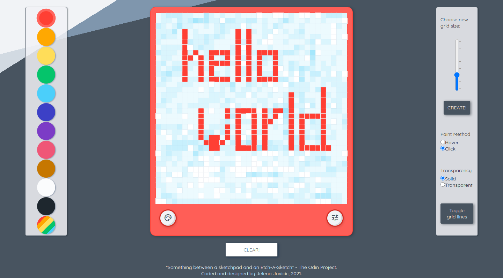

# The Odin Project - Etch-A-Sketch

"A browser version of something between a sketchpad and an Etch-A-Sketch." Built for [The Odin Project](https://www.theodinproject.com).

## Table of contents

- [Overview](#overview)
  - [Description](#description)
  - [Screenshot](#screenshot)
  - [Links](#links)
- [My process](#my-process)
  - [Built with](#built-with)
  - [The process](#the-process)
  - [Further development](#further-development)
  - [Useful resources](#useful-resources)
- [Author](#author)

## Overview

### Description

The aim of this project was to understand the basics of DOM manipulation. The result is a simple pixel art tool where user is presented with several options:

- Pick from a pallete of 11 colors or draw with random colors.
- Choose to draw either by hovering or clicking with the mouse.
- Choose between solid colors or shading.
- Toggle grid lines on canvas.
- Choose size and create new grid.

The basic design is meant to resemble the classic etch-a-sketch toy.

### Screenshot

### Links

- [Solution](https://github.com/je-jo/etch-a-sketch)
- [Live Site](https://je-jo.github.io/etch-a-sketch/)

## My process

### Built with

- Semantic HTML5 markup
- CSS custom properties
- Flexbox
- CSS Grid
- Mobile-first workflow
- Javascript

### The process

Starting the project was quite easy. I gained confidence in my JS skills as grid creation and coloring the squares were quite simple to implement.

Then lost confidence again with the extra options, especially when writting the function for incremental opacity option.

Then spent a lot of time on styling and responsiveness.

### Future development

- Add touch support
- Style slider and radio buttons, make "toggle grid" into actual toggle button.
- Add animation to hidable menus
- Add shaking animation when clear button is pressed.
- Export drawings?
- Choose between different color palettes?

### Useful resources

- [Minireset](https://awesomeopensource.com/project/jgthms/minireset.css?categoryPage=29) - A tiny modern CSS reset. 
- [Material icons](https://fonts.google.com/icons)
- [Box Shadows](https://box-shadow.dev/) A fun and useful tool for playing around with box shadows.
- [Flat UI Colors](https://flatuicolors.com/) I used Swedish palette.
- [This pen](https://codepen.io/MadeByMike/pen/dRoLpJ) shows a super useful way of using CSS variables.
- [This stackoverflow thread](https://stackoverflow.com/questions/56741923/gradually-increment-the-opacity-for-etch-a-sketch-project) helped me understand and solve opacity changing.
- [This great CSS-Tricks article](https://css-tricks.com/background-patterns-simplified-by-conic-gradients/) about conic backgrounds.

## Author

- [Github](https://github.com/je-jo)
- [Frontend Mentor](https://www.frontendmentor.io/profile/je-jo)
- [Codepen](https://codepen.io/je-jo)
